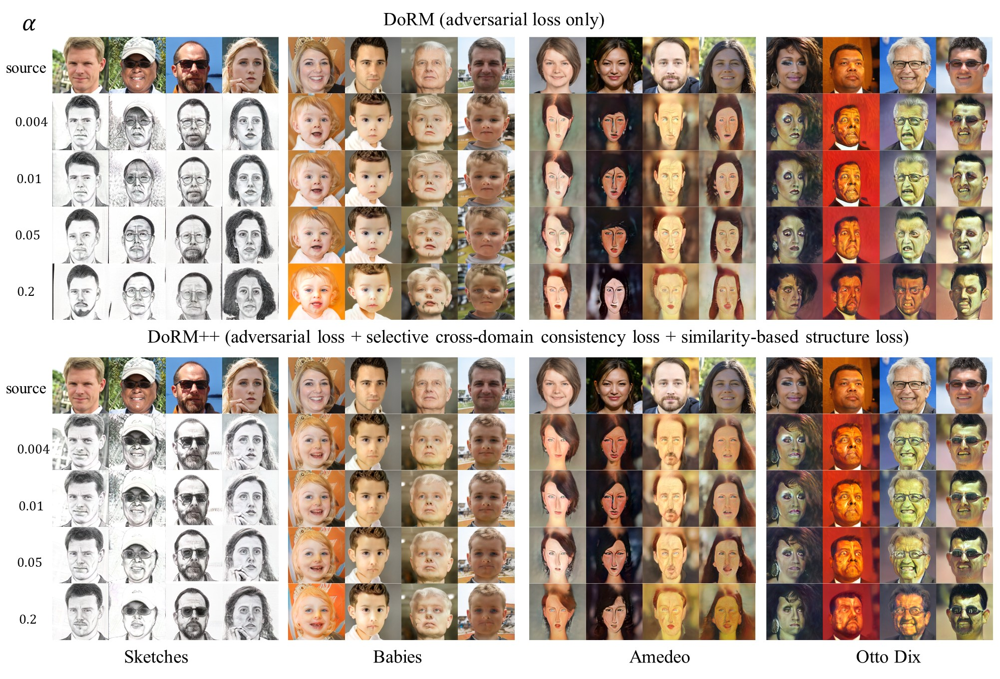
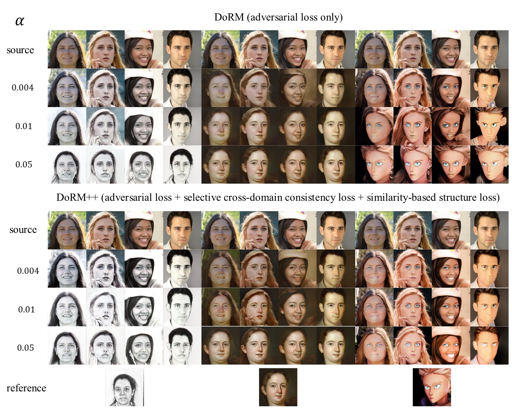
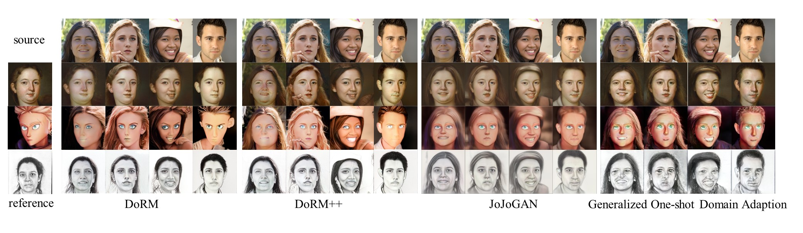

# Qualitative results of DoRM and DoRM++

## 10-shot GDA
In this section, we illustrate the qualitative results of DoRM and DoRM++ on 10-shot GDA. Note that the Scalable Vector Graphics of images can be found in the corresponding PDF file.

#### 10 training images on 10-shot GDA

#### Qualitative results of DoRM and DoRM++ on 10-shot GDA

As illustrated in the figure, we can address the follow weaknesses of our DoRM mentioned by the reviewers through adjusting the hyper-parameter $\alpha$:

1. Due to the limited adaptation capability, DoRM won’t be able to handle hard task, e.g., FFHQ=>Amadeo Painting and FFHQ=>Sketch.
2. The sketch results generated by DoRM contain background, making the performance looks inferior to other methods.
3. Unnatural blurs and artifacts can be found in many samples of GDA, e.g., FFHQ --> Babies.

Additionally, the proposed DoRM++ has reduced the sensitivity of the hyperparameters $\alpha$ and improves the performance in terms of both source-domain and cross-domain consistency, significantly.

## 1-shot GDA
As illustarted in figures, we can also address the weaknesses of our DoRM mentioned by the reviewers through adjusting the hyper-parameter $\alpha$ on the 1-shot GDA. Morever, our proposed DoRM++ has outpermed the SOTA methods in terms of both cross-domain and target domain consistency.

#### Qualitative results of DoRM and DoRM++ on 1-shot GDA

#### Qualitative comparison with SOTA methods on 1-shot GDA

