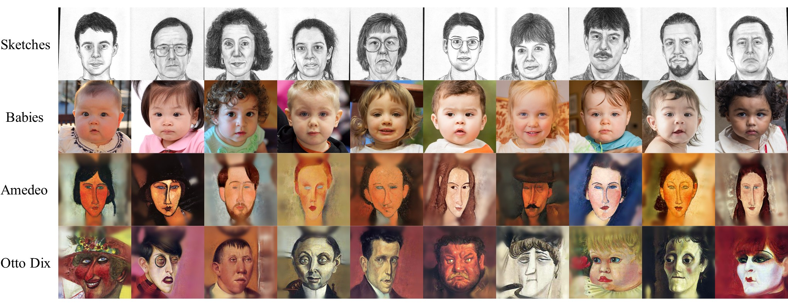

## The proposed DoRM++

The proposed approach DoRM++ have been shown below:

1) $\textbf{Selective cross-domain consistency loss}$ $L_{scc}$ [1]

We begin by adopting the selective cross-domain consistency loss, $L_{scc}$, as proposed in [1]. This loss function aims to identify and preserve domain-sharing attributes in the $W+$ space. The underlying assumption is that attributes that are similar between the source and target domains during adaptation are more likely to be domain-sharing attributes. To achieve this, $L_{scc}$ dynamically analyzes and retains these attributes. First, it inverts the source and corresponding target images into $W+$ latent codes, $w_A$ and $w_B$, respectively, using a pre-trained inversion model such as pSp or e4e, for each iteration. Next, it computes the difference, $\Delta w$, between the centers of a source queue of $W+$ latent codes, $X_A$, and a target queue of $W+$ latent codes, $X_B$, where $X_A$ and $X_B$ are dynamically updated with $w_A$ and $w_B$ during training. The loss function then encourages $w_A$ and $w_B$ to be consistent in channels with less difference, thereby facilitating the preservation of domain-sharing attributes. 

The selective cross-domain consistency loss, $\mathcal{L}_{scc}$, is defined as follows:

$\mathcal{L}_{s c c}=\left\|\operatorname{mask}(\Delta \boldsymbol{w}, \alpha) \cdot\left(\boldsymbol{w}_B-\boldsymbol{w}_A\right)\right\|_1$.

Here, $\alpha$ represents the proportion of preserved attributes, and $\operatorname{mask}(\Delta \boldsymbol{w}, \alpha)$ determines which channels to retain. Specifically, let $\left|\Delta \boldsymbol{w}_{s_{\alpha N}}\right|$ be the $\alpha N$-th largest element of $\Delta \boldsymbol{w}$. Then, each dimension of $\operatorname{mask}(\Delta \boldsymbol{w}, \alpha)$ is calculated as follows:

$\operatorname{mask}(\Delta \boldsymbol{w}, \alpha)_i= \begin{cases}1 & \left|\Delta \boldsymbol{w}_i\right|<\left|\Delta \boldsymbol{w}_{s_{\alpha N}}\right| \\ 0 & \left|\Delta \boldsymbol{w}_i\right| \geq\left|\Delta \boldsymbol{w}_{s_{\alpha N}}\right|\end{cases}$

The objective of $\mathcal{L}_{scc}$ is to maintain cross-domain consistency between the source and target domains. This consistency typically indicates structural information. Therefore, we adopt latent codes corresponding to coarse spatial resolutions (4–8) and middle resolutions (16–32) in $\mathcal{L}_{scc}$.

2) $\textbf{Similarity-based structure loss} L_{ss}$

To explicitly model cross-domain consistency, we propose a novel similarity-based structure loss called $L_{ss}$. Our intuition is that the autocorrelation maps of the source image and its corresponding target image should be consistent. To achieve this, we extract the intermediate tokens $F_A$ and $F_B$ of the source image $I_A$ and its corresponding target image $I_B$ from the k-th layer of the CLIP image encoder. These tokens are denoted by $\boldsymbol{F}_A=\left\{\boldsymbol{F}_A^1, \ldots, \boldsymbol{F}_A^n\right\}$ and $\boldsymbol{F}_B=\left\{\boldsymbol{F}_B^1, \ldots, \boldsymbol{F}_B^n\right\}$, respectively. We define the autocorrelation maps as $\boldsymbol{M}_A=\frac{\boldsymbol{F}^T_A}{\left|\boldsymbol{F}^T_A\right|}\times \frac{\boldsymbol{F}_A}{\left|\boldsymbol{F}_A\right|}$ and $\frac{\boldsymbol{F}^T_B}{\left|\boldsymbol{F}^T_B\right|}\times \frac{\boldsymbol{F}_B}{\left|\boldsymbol{F}_B\right|}$, where $\boldsymbol{M}_A^{i,j}=\frac{\boldsymbol{F}_A^i \cdot\boldsymbol{F}_A^j}{\left|\boldsymbol{F}_A^i\right| \left|\boldsymbol{F}_A^j\right|}$ and $\boldsymbol{M}_B^{i,j}=\frac{\boldsymbol{F}_B^i \cdot\boldsymbol{F}_B^j}{\left|\boldsymbol{F}_B^i\right| \left|\boldsymbol{F}_B^j\right|}$. $L{ss}$ is then defined as the L1 norm of the difference between $\boldsymbol{M}_A$ and $\boldsymbol{M}_B$:

$L_{ss}=\frac{1}{n^2}\sum_{i=1}^n\sum_{j=1}^n\left\|M^{i,j}_A-M^{i,j}_B\right\|_1$

3) $\textbf{Overall Training Loss}$

The loss of the proposed DoRM++ consists of three terms, the adversarial loss $L_{adv}$, selective cross-domain consistency loss $L_{scc}$, and similarity-based structure loss $L_{ss}$.

$L_{overall}=L_{adv}+\lambda_{scc} L_{scc}+\lambda_{ss}L_{ss}$

In the most experiments, we use $\lambda_{scc}=6\cdot\frac{n_{iter}}{N_{iter}}$ and $\lambda_{ss}=50$, where $N_{iter}$ and $n_{iter}$ denote the total number of training iterations and the $n_{iter}$-th iteration of training, respectively. That is, $\lambda_{scc}$ increases linearly as the training proceeds. Besides, when the target domain is among FFHQ-Baby, Amedeo and Otto Dix, we use $\lambda_{scc}=3\cdot\frac{n_{iter}}{N_{iter}}$ and $\lambda_{ss}=10$.

[1] Towards Diverse and Faithful One-shot Adaption of Generative Adversarial Networks. NIPS 2022

## 10-shot GDA
In this section, we illustrate the qualitative results of DoRM and DoRM++ on 10-shot GDA. Note that the Scalable Vector Graphics of images can be found in the corresponding PDF file.

#### 10 training images on 10-shot GDA

#### Qualitative results of DoRM and DoRM++ on 10-shot GDA

As illustrated in the figure, we can address the follow weaknesses of our DoRM mentioned by the reviewers through adjusting the hyper-parameter $\alpha$:

1. Due to the limited adaptation capability, DoRM won’t be able to handle hard task, e.g., FFHQ=>Amadeo Painting and FFHQ=>Sketch.
2. The sketch results generated by DoRM contain background, making the performance looks inferior to other methods.
3. Unnatural blurs and artifacts can be found in many samples of GDA, e.g., FFHQ --> Babies.

Additionally, the proposed DoRM++ has reduced the sensitivity of the hyperparameters $\alpha$ and improves the performance in terms of both source-domain and cross-domain consistency, significantly.

## 1-shot GDA
As illustarted in figures, we can also address the weaknesses of our DoRM mentioned by the reviewers through adjusting the hyper-parameter $\alpha$ on the 1-shot GDA. Morever, our proposed DoRM++ has outpermed the SOTA methods in terms of both cross-domain and target domain consistency.

#### Qualitative results of DoRM and DoRM++ on 1-shot GDA

#### Qualitative comparison with SOTA methods on 1-shot GDA

